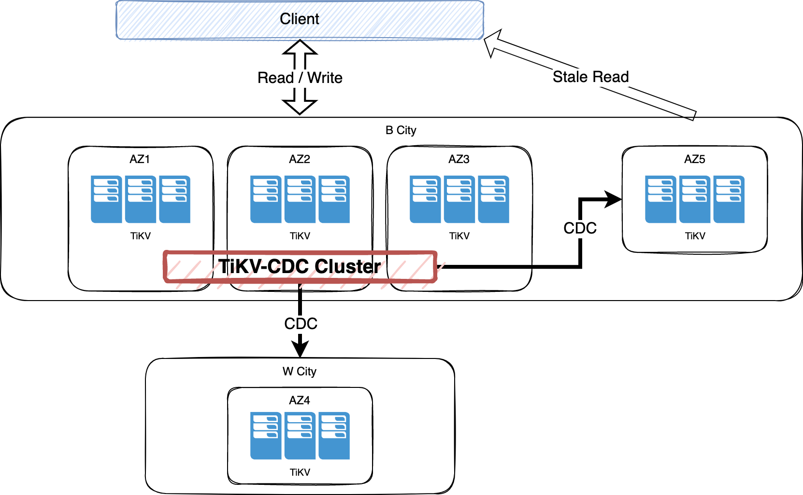

# RawKV Cross Cluster Replication

- RFC PR: https://github.com/tikv/rfcs/pull/0000
- Tracking Issue: https://github.com/tikv/repo/issues/0000

## Summary

The proposal introduces the technical design of RawKV cross cluster replication.

## Motivation

Customers are deploying TiKV clusters as raw Key-Value (RawKV) storage. But the lack of cross cluster replication is a obstacle to provide more highly available services by deploying cross city disaster recovery clusters.

Providing ability of cross cluster replication will help TiKV be more adoptable to industries such as banking and finance.

## Detailed Design

### 1. Utilize TiCDC as Data Replication Component

[TiCDC](https://docs.pingcap.com/tidb/stable/ticdc-overview) is the tool for replicating the incremental data of TiDB nowadays. As TiCDC captures change data from MVCC tier of TiKV, the replication of RawKV data has a lot in common with replication of TiDB. So utilize TiCDC as data replication component will significantly reduce the workloads, by reusing features such as task management, metrics, high available, load balancing, etc.

Besides, TiCDC can also provide the ability to connect to other components, e.g. Message Queues, which will help TiKV integrate with customers' data systems, and further extend the applicable scenarios of TiKV.

### 2. Add Timestamp to Data

As a kind of [Change Data Capture](https://en.wikipedia.org/wiki/Change_data_capture), timestamp (or version) is necessary to indicate which data is changed. While RawKV doesn't have such a thing before, we need to add timestamp to the RawKV data.

#### 2.1 Requirement

Among requests of a key, Order of Timestamp must be the same as sequence of data flush to disk in TiKV.

In general, if request `a` ["happened before"](https://en.wikipedia.org/wiki/Happened-before) `b`, then `Timestamp(a) < Timestamp(b)`. As to cross cluster replication, we provide [Causal Consistency](https://en.wikipedia.org/wiki/Causal_consistency) by keeping order of the timestamp the same as sequence of data flush to disk in TiKV. Downstream systems apply data according to the timestamp order, will always lead to the consistent result.

At the same time, as RawKV doesn't provide cross-rows transaction and snapshot isolation, we treat requests of different keys as concurrent, to reduce complexity and improve performance.

#### 2.2 Timestamp Generation

Timestamp is generated by TiKV internally, to get a better overall performance and client compatibility.

We use [HLC](https://cse.buffalo.edu/tech-reports/2014-04.pdf) method to generate timestamp, which not only is easy to use (by being closed to real world time), but also can capture causality.

##### 2.2.1 Physical Time of Timestamp

Physical time of HLC is acquired from TSO of [PD](https://github.com/tikv/pd).

TSO is a global monotonically increasing timestamp (is also a kind of HLC), which help the generation of timestamp be independent to local clock of machine, and be immune to issues such as reverse between machine reboot.

Physical time is refreshed by repeatedly acquiring TSO in a period of `1s`, to keep it be closed the real world time. And it can tolerate fault of TSO no longer than `30s`, to keep time-related metrics such as RPO reasonable.

Besides, on startup, physical time must be initialized by a successful TSO.

##### 2.2.2 Logical Time of Timestamp

Logical time is advanced on every write request.

Moreover, logical time is advanced on leader transfer. As TiKV a distributed system, every store in TiKV cluster has a instance of timestamp generator. As every key is existed in only one region and only one peer (the leader) in a region can write, it's safe to generate timestamp locally in every store, except for leader transfer.

On leader transfer, the timestamp generated by other store would be bigger than the store where new leader located, which will violate the causal consistency requirement. We solve this by this method: Every peer is observing raft message applied, and keep the maximum timestamp of the region (called `Region-Max-TS`). On become leader, this peer advances timestamp generator of store to be bigger than `Region-Max-TS`. 

Besides, other region changes should be carefully handled:

* On region merge: The `Region-Max-TS` of the region is the bigger one of the original two regions.

* On region split: The `Region-Max-TS` of the new region is copied from the original one.

#### 2.3 Resolved_ts

### 3. Deletion

### 4. Encoding

## Prototype

## Drawbacks

Why should we not do this?

## Alternatives

- Why is this design the best in the space of possible designs?
- What other designs have been considered and what is the rationale for not
  choosing them?
- What is the impact of not doing this?

## Unresolved questions

What parts of the design are still to be determined?
